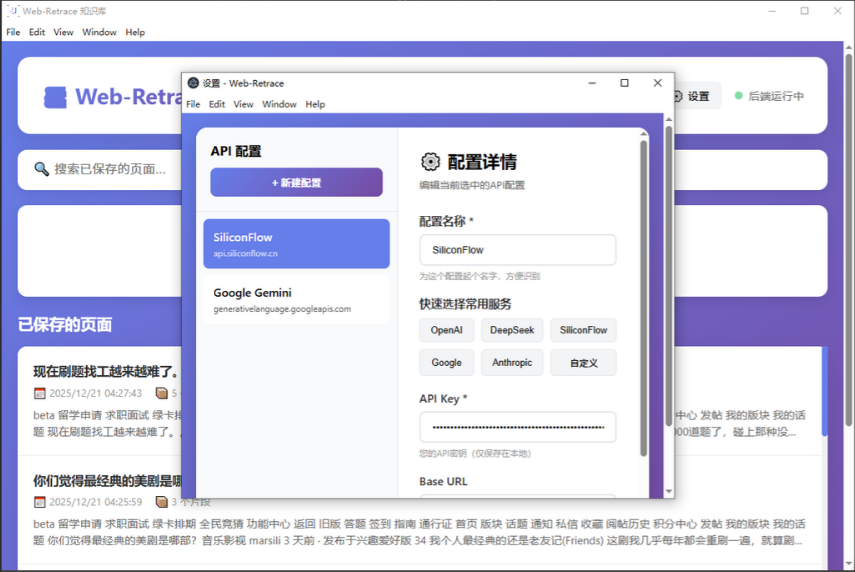
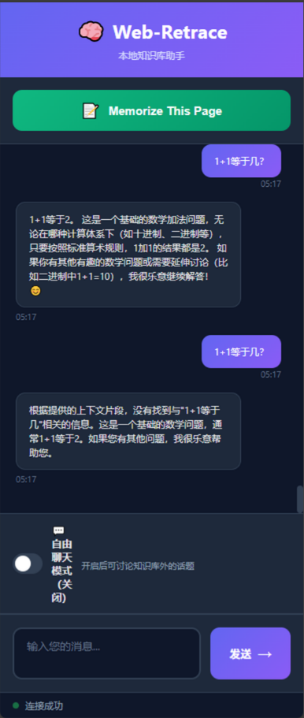

# web-retrace

A local-first RAG knowledge base for browser history. (基于 RAG 技术的本地浏览器历史记录知识库)

# 🧠 Web-Retrace: 本地化浏览器历史记录 RAG 知识库

> **基于 AI Agent (Google AntiGravity) 辅助开发的全栈 RAG 检索工具** > *让你的浏览器拥有一颗“过目不忘”的本地大脑。*

---

## 📖 项目简介 (Introduction)

**Web-Retrace** 是一个“本地优先” (Local-First) 的浏览器辅助工具。它旨在解决传统浏览器历史记录无法进行“内容检索”的痛点。

通过 Chrome 插件采集网页内容，利用本地向量数据库 (ChromaDB) 进行存储，并结合 LLM (大语言模型) 实现基于语义的智能问答。项目包含 **Chrome 浏览器插件** 与 **桌面客户端**，支持 RAG (检索增强生成) 与自由对话双模式切换。

## ✨ 核心功能 (Features)

### 1. 🖥️ 桌面客户端 (Desktop Client)

- **多模型管理**：支持自定义配置 DeepSeek, OpenAI, SiliconFlow, Google Gemini 等多种 LLM API。
- **可视化配置**：直观的 API Key 管理与 Base URL 设置，无需修改代码配置文件。
- **状态监控**：实时查看后端服务连接状态。

### 2. 🧩 浏览器插件 (Chrome Extension)

- **侧边栏助手**：无需离开当前网页，通过 SidePanel 直接唤起助手。
- **一键记忆**：点击 "Memorize This Page" 即可将当前网页内容切片并存入本地向量库。
- **双模式切换**：
  - **RAG 模式**：基于本地存储的历史网页内容回答问题。
  - **自由对话模式**：脱离知识库，作为普通的 AI 聊天助手使用。

### 3. 🔒 数据隐私与安全

- **本地存储**：所有向量数据存储于本地 ChromaDB，不上传第三方服务器。
- **API直连**：用户直接与模型提供商交互，保护 Key 的安全。

---

## 📸 项目演示 (Screenshots)

### 桌面端：API 配置与多模型切换


*(支持 SiliconFlow, Gemini 等多厂商 API 快速切换)*

### 插件端：RAG 问答与自由对话模式


*(支持自由对话开关，精准引用本地历史记录)*

---

## 🛠️ 技术栈 (Tech Stack)

本项目采用前后端分离架构，由 AI 辅助完成全栈原型构建：

- **Backend (后端)**: Python 3.12+, FastAPI, LangChain, ChromaDB (Vector Store)
- **Frontend (插件)**: Chrome Extension Manifest V3, HTML/JS
- **Client (客户端)**: Electron
- **AI Tooling**: Google AntiGravity (IDE), Trae (Agent)

---

## 🚀 快速开始 (Getting Started)

### 前置要求

- Python 3.10+
- Node.js & npm
- Chrome 浏览器

### 1. 启动后端服务

```bash
cd backend
pip install -r requirements.txt
# 解决 Python 3.13 下 langchain 依赖冲突问题，请确保使用兼容版本
python main.py
```


### 2. 加载浏览器插件

1. 打开 Chrome 浏览器，进入 `chrome://extensions/`

2. 开启右上角 **"开发者模式"**。

3. 点击 **"加载已解压的扩展程序"**，选择本项目下的 `extension` 目录。

### 3. 启动桌面客户端

Bash

```
cd desktop-client
npm install
npm start
```

---

## 📝 开发与排错记录 (Dev & Troubleshooting)

本项目主要由 **Google AntiGravity** 辅助生成，在开发过程中重点解决了以下工程化问题：

- **Python 依赖地狱 (Dependency Hell)**: 解决了 `langchain` 与 `numpy` 在 Python 3.13 环境下的版本兼容性问题。

- **跨域资源共享 (CORS)**: 配置 FastAPI 中间件，打通了 Chrome 插件 (前端) 与 本地 Python 服务 (后端) 的通信链路。

- **RAG 效果调优**: 针对网页噪声数据，优化了 `RecursiveCharacterTextSplitter` 的切片参数 (Chunk Size 1000 / Overlap 200)，显著提升了召回准确率。

---

## 🤝 贡献与致谢

- 感谢 **Google AntiGravity** 与 **Trae** 提供的高效 AI 编程辅助。

- 本项目为个人学习与自研工具，欢迎 Issue 反馈。
